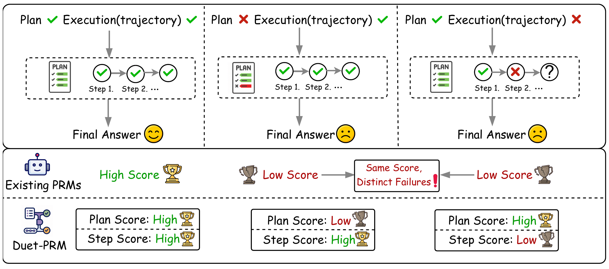
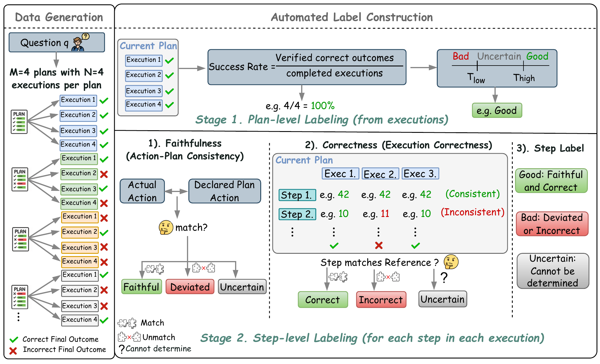

# Duet-PRM: Plan-and-Step Factorized Process Reward Modeling

🧭 Plan Quality | 🔎 Step Verification | 🏆 Best-of-N Selection

> A data construction, training, and evaluation pipeline for process reward models that score solution plans and execution steps separately.

[](https://www.python.org/downloads/)
[](LICENSE)
<!--
[](ARXIV_URL)
-->

---

## 🧭 Overview

**Duet-PRM** factorizes process supervision into two complementary signals:

- **Plan score** evaluates whether a proposed solution strategy is likely to lead to a correct and complete answer.
- **Step score** evaluates whether the current execution step is faithful to the plan and supported by its computation.

The repository covers the complete experimental workflow: sampling plan-conditioned tool-integrated reasoning trajectories, assigning rule-based adherence and execution labels, assembling supervised fine-tuning data, training a generative PRM with LLaMA-Factory, and evaluating it through Best-of-N selection and chain-level separation metrics.

<div align="center">
  
</div>

---

## 🧩 Framework

| Stage | Script | Description |
|---|---|---|
| 1. Candidate Generation | `sample_minimal.py` | Samples multiple plans and multiple executions for every problem |
| 2. Plan Adherence | `label_minimal.py` | Labels whether each execution follows its claimed plan stage |
| 3. Execution Verification | `verify_rules.py` | Assigns rule-based correctness evidence and provenance |
| 4. Dataset Assembly | `assemble_dataset.py` | Converts plan and step signals into generative PRM SFT examples |
| 5. PRM Training | `run_prm_sft.sh` | Registers the dataset and launches full-parameter training with LLaMA-Factory |
| 6. Evaluation | `eval_bon.py` | Evaluates majority voting, PRM selection, and multi-GPU Best-of-N |

The trained model outputs two discrete scores:

```text
<plan_score>0.0|0.5|1.0</plan_score>
<step_score>0.0|0.5|1.0</step_score>
```

<div align="center">
  
</div>

---

## 📦 Repository Structure

```text
.
├── sample_minimal.py              # Training trajectory generation
├── sample_minimal_ref.py          # Evaluation candidate-chain generation
├── label_minimal.py               # Plan-adherence labeling
├── verify_rules.py                # Execution verification and provenance
├── assemble_dataset.py            # SFT dataset assembly
├── verifier.py                    # Mathematical answer verification
├── prm_sft.yaml                   # Active full-parameter SFT configuration
├── run_prm_sft.sh                 # Dataset registration and training launcher
├── register_dataset.json          # Manual LLaMA-Factory registration example
├── eval_bon.py                    # Best-of-N evaluation
├── run_eval_parallel.sh           # Multi-GPU data-parallel evaluation
├── bon_vote.py                    # Answer-group PRM-weighted voting
├── run_bon_vote.sh                # Multi-GPU weighted-voting launcher
├── eval_separation.py             # Separation, Cohen's d, and AUC analysis
├── run_bench_separation.py        # End-to-end benchmark separation evaluation
├── data_env/requirements.txt      # Construction and evaluation environment
├── trainer_env/requirements.txt   # Training environment
├── LLaMA-Factory/                 # Training framework
└── skywork-o1-prm-inference-main/ # Skywork baseline inference utilities
```

Generated data, checkpoints, logs, and evaluation outputs are written under `runs/` or a user-specified output directory and are not included in the repository.

---

## 🚀 Quick Start

### Installation

The construction/evaluation and training environments are kept separate because they use different dependency versions. Linux with CUDA-capable GPUs is recommended.

For data construction and evaluation:

```bash
conda create -n duet-data python=3.10 -y
conda activate duet-data
pip install -r data_env/requirements.txt
```

For training:

```bash
conda create -n duet-train python=3.10 -y
conda activate duet-train
pip install -r trainer_env/requirements.txt
pip install -e ./LLaMA-Factory
```

### Input Format

The canonical problem file is JSONL with one problem per line:

```json
{"problem": "Solve ...", "answer": "42"}
```

The `answer` field is needed to compute trajectory correctness and plan-quality labels. `sample_minimal_ref.py` additionally normalizes common benchmark fields such as `question`, `prompt`, `final_answer`, `gt_answer`, and GSM8K-style answers.

---

## 🏗️ Data Construction

### 1. Generate Plan-Conditioned Trajectories

```bash
conda activate duet-data

python sample_minimal.py \
  --model /path/to/Qwen3-8B \
  --problems /path/to/train.jsonl \
  --out runs/train \
  --n_problems 1000 \
  --M 2 \
  --N 4 \
  --tp 8
```

This produces `runs/train/trajectories.jsonl`. Here, `M` is the number of plans per problem and `N` is the number of executions sampled for each plan.

### 2. Label Plan Adherence

```bash
python label_minimal.py \
  --traj runs/train/trajectories.jsonl \
  --out runs/train/step_labels.jsonl
```

### 3. Verify Execution Steps

```bash
python verify_rules.py \
  --traj runs/train/trajectories.jsonl \
  --labels runs/train/step_labels.jsonl \
  --out runs/train/c2_labels.jsonl
```

### 4. Assemble the SFT Dataset

```bash
python assemble_dataset.py \
  --traj runs/train/trajectories.jsonl \
  --labels runs/train/step_labels.jsonl \
  --c2 runs/train/c2_labels.jsonl \
  --problems /path/to/train.jsonl \
  --out runs/train/sft_dataset.jsonl
```

The assembled file uses the Alpaca fields `instruction`, `input`, and `output`, together with traceability metadata for the originating problem, plan, execution, and step.

---

## 🏋️ Training

The active configuration in `prm_sft.yaml` performs full-parameter SFT with DeepSpeed ZeRO-3 on eight GPUs. Training starts from the base model and never resumes from an old checkpoint automatically.

Set the three required paths and launch training:

```bash
conda activate duet-train

export SFT_DATA=/absolute/path/to/runs/train/sft_dataset.jsonl
export MODEL=/absolute/path/to/Qwen2.5-Math-7B-Instruct
export OUTPUT_DIR=/absolute/path/to/duet-prm-checkpoints

bash run_prm_sft.sh /absolute/path/to/Duet-PRM/LLaMA-Factory
```

`OUTPUT_DIR` must be new or empty. The launcher stops before training if the directory already contains files, preventing accidental checkpoint reuse.

---

## 📊 Evaluation

### Generate Evaluation Candidates

Use `sample_minimal_ref.py` for benchmark datasets. It keeps a fixed candidate structure and supports several common problem/answer schemas.

```bash
conda activate duet-data

python sample_minimal_ref.py \
  --model /path/to/Qwen3-8B \
  --problems /path/to/test.jsonl \
  --out runs/eval \
  --n_problems 500 \
  --M 2 \
  --N 4 \
  --tp 8
```

### Majority-Vote Baseline

```bash
python eval_bon.py \
  --mode majority \
  --traj runs/eval/trajectories.jsonl \
  --problems /path/to/test.jsonl \
  --out runs/eval/bon_majority.json
```

### Duet-PRM Best-of-N

```bash
EXTRA_ARGS="--dual_score --score_scheme v6" \
bash run_eval_parallel.sh \
  ours \
  /path/to/trained-duet-prm \
  runs/eval/trajectories.jsonl \
  /path/to/test.jsonl \
  runs/eval/bon_duet_prm.json \
  8
```

`--score_scheme` must match the checkpoint's training targets:

| Scheme | Plan Target | Step Target |
|---|---|---|
| `v6` | Three classes: 0.0 / 0.5 / 1.0 | Three classes: 0.0 / 0.5 / 1.0 |
| `step01` | Three classes | Binary: 0.0 / 1.0 |
| `full01` | Binary: 0.0 / 1.0 | Binary: 0.0 / 1.0 |

The same evaluator also supports `scalar` and `skywork` modes for external PRM baselines.

### PRM-Weighted Answer Voting

```bash
bash run_bon_vote.sh \
  ours \
  /path/to/trained-duet-prm \
  runs/eval/trajectories.jsonl \
  /path/to/test.jsonl \
  v6 \
  runs/eval/weighted_vote \
  8
```

### Chain-Level Separation

To measure how well scores distinguish correct from incorrect reasoning chains:

```bash
python run_bench_separation.py \
  --traj runs/eval/trajectories.jsonl \
  --problems /path/to/test.jsonl \
  --mode ours \
  --prm /path/to/trained-duet-prm \
  --dual_score \
  --score_scheme v6 \
  --how mean,min \
  --out runs/eval/separation_report.json
```

The report includes raw separation, Cohen's d, AUC, and problem-level cluster-bootstrap confidence intervals.

---

## 📝 Reproducibility Notes

- Keep `M`, `N`, decoding temperatures, and random seeds fixed when comparing PRMs.
- Reuse the same candidate trajectories across selection methods for a fair Best-of-N comparison.
- Always pass the original problem file during evaluation; otherwise the evaluator must fall back to incomplete trajectory context.
- Match `--score_scheme` to the training target format used by the evaluated checkpoint.
- Use a fresh `OUTPUT_DIR` for every training run.

<!--
## 📄 Paper

Paper link: ARXIV_URL

## 📖 Citation

The BibTeX entry will be added after the paper is publicly available.
-->

---

## ⭐ Acknowledgements

This repository builds on [LLaMA-Factory](https://github.com/hiyouga/LLaMA-Factory), [vLLM](https://github.com/vllm-project/vllm), the Qwen model family, and the Skywork process-reward-model inference utilities included for baseline evaluation.
